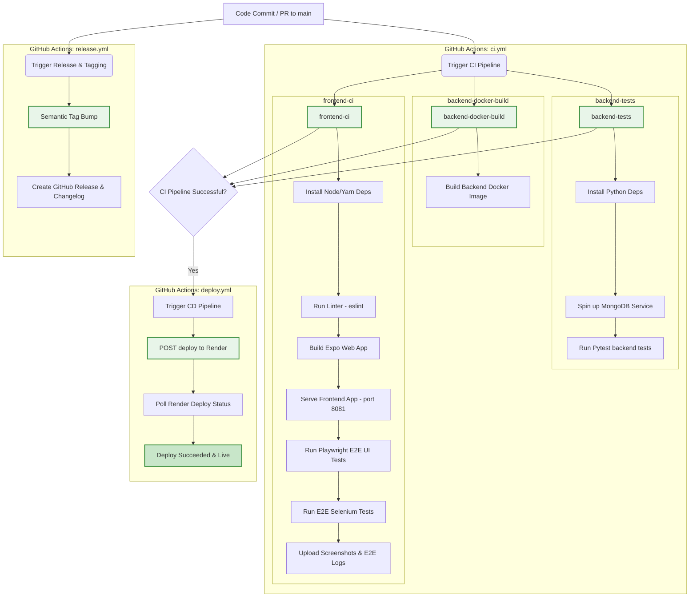

# E2E Test Suite and Workflow Architecture

This document provides a comprehensive overview of the testing structure, flow, and the CI/CD pipeline architecture implemented in the application repository.

---

## 📊 CI/CD Workflow & Testing Pipeline

The diagram below illustrates the continuous integration, continuous deployment, and automated release workflows configured for the repository.

---

## 📝 Test suite Descriptions

The application leverages multiple testing strategies to ensure API reliability, front-end usability, database persistence, and system performance.

### 1. Backend Integration & Unit Tests (`pytest`)
* **Location:** [`backend/tests/`](file:///c:/Users/ajith%20kumar/Shadow/shadow/backend/tests/)
* **Execution:** `python -m pytest --ignore=tests/test_selenium.py`
* **Purpose:** Validates individual API endpoints, authentication logic, token generation, user account modifications, and MongoDB interactions.
* **Database Dependency:** Runs against a localized `mongodb` service instance mapped to port `27017` in the GHA runner.

### 2. Frontend Playwright E2E UI Tests (`playwright`)
* **Location:** [`frontend/e2e_test.js`](file:///c:/Users/ajith%20kumar/Shadow/shadow/frontend/e2e_test.js)
* **Execution:** `node e2e_test.js`
* **Purpose:** Runs inside a headless Chromium browser to perform real user actions on the Expo web application.
* **Test Flow:**
  - Navigates to `/register`, fills in registration details, and submits the form.
  - Intercepts the screen to extract the Demo OTP code and submits it to `/verify-email`.
  - Logs in, creates a character (class Netrunner, select avatar), and lands on the `/dashboard`.
  - Asserts correct starting coins (`100 CR`).
  - Verifies bottom-tab navigation and deep redirection (Story, Leaderboard, Gear/Inventory, HQ/Dashboard).
  - Starts and completes the first puzzle mission (`First Contact`) and asserts that coins increase to `150 CR`.
  - Captures and saves run screenshots on success/failure in `frontend/screenshots/`.

### 3. Selenium E2E UI Tests (`selenium`)
* **Location:** [`backend/tests/test_selenium.py`](file:///c:/Users/ajith%20kumar/Shadow/shadow/backend/tests/test_selenium.py)
* **Execution:** `python -m pytest tests/test_selenium.py`
* **Purpose:** Provides cross-language E2E validation using Python selenium webdriver to verify user flow, screen responsiveness (resizing to mobile dimensions), profile metrics, and logout routines.
* **Execution Strategy:** Configured to dynamically fallback to default system Chrome configurations in the Linux CI environment when local Windows playwright Chrome paths are absent.

### 4. Backend Load Testing (`httpx` + `asyncio`)
* **Location:** [`backend/tests/load_test.py`](file:///c:/Users/ajith%20kumar/Shadow/shadow/backend/tests/load_test.py)
* **Execution:** `python backend/tests/load_test.py --concurrency N`
* **Purpose:** Tests backend server robustness and endpoint latencies under high concurrent request volume.
* **Metrics Tracked:** 
  - RSS Memory utilization of the Uvicorn FastAPI server process (tracks max memory and leakage).
  - Endpoint latency percentiles (P50, P95, P99) and average latency.
  - Overall request success vs. failure rates.
